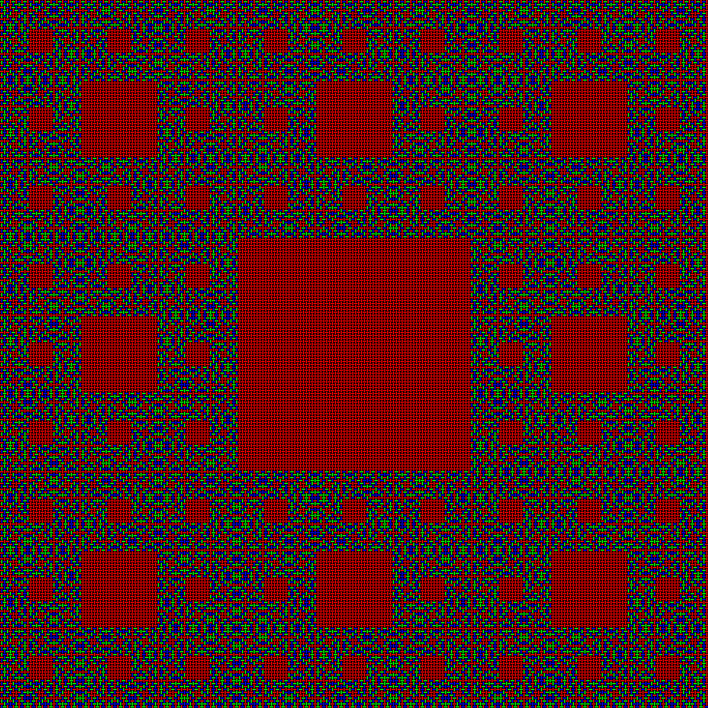

# Sierpinski Carpet

A Python script for creating renders of Sierpinski Carpets - Requires `pillow` package.

## Ref

- [A Wild Sierpinski Carpet Appeared! (out of tricolour weaving and nobody knows why)](https://www.youtube.com/watch?v=OwsUm7kVYTI) - Ayliean (YouTube)
- [Oh What a Complex Rug We Weave When First We Color Then Perceive](https://archive.bridgesmathart.org/2023/bridges2023-377.html#gsc.tab=0) - Barry Cipra and Paul Zorn
